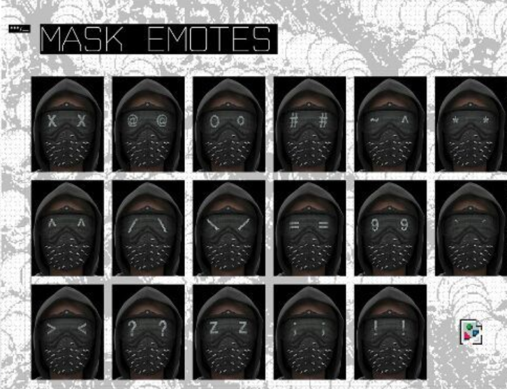

# Wrench expressions mask (Watch Dogs 2)

Arduino-driven LED-matrix “eyes” inspired by Wrench’s mask from *Watch Dogs 2*. Two MAX7219 8×8 matrices show custom emotes (wink, sad, angry, punctuation, and more). Built as a fun wearables / mechatronics project.

A natural next step would be on-device expression classification so the mask mirrors the wearer’s face in real time. The current firmware cycles a set of hand-authored patterns.

## Demo



| Clip | File |
| --- | --- |
| Demo 1 | [docs/media/demo-1.mp4](docs/media/demo-1.mp4) |
| Demo 2 | [docs/media/demo-2.mp4](docs/media/demo-2.mp4) |

Photos and extra views: [docs/reports/final-view.pdf](docs/reports/final-view.pdf)

## Hardware

- Microcontroller board programmed with the Arduino IDE
- Two MAX7219-driven 8×8 LED matrices (left and right eyes)
- Wiring in firmware: DIN/CS/CLK on pins 10–8 (right) and 7–5 (left)

## Firmware

Sketch: [`Wrench_final_mask/Wrench_final_mask.ino`](Wrench_final_mask/Wrench_final_mask.ino)

Uses [LedControl](https://github.com/wayoda/LedControl) to push 8-byte bitmaps to each matrix.

1. Install the Arduino IDE and the LedControl library.
2. Open `Wrench_final_mask/Wrench_final_mask.ino`.
3. Select your board and port, then upload.

## Layout

```
Wrench_final_mask/     Arduino sketch
docs/media/            photos and demo videos
docs/reports/          build photos / final views (PDF)
```
